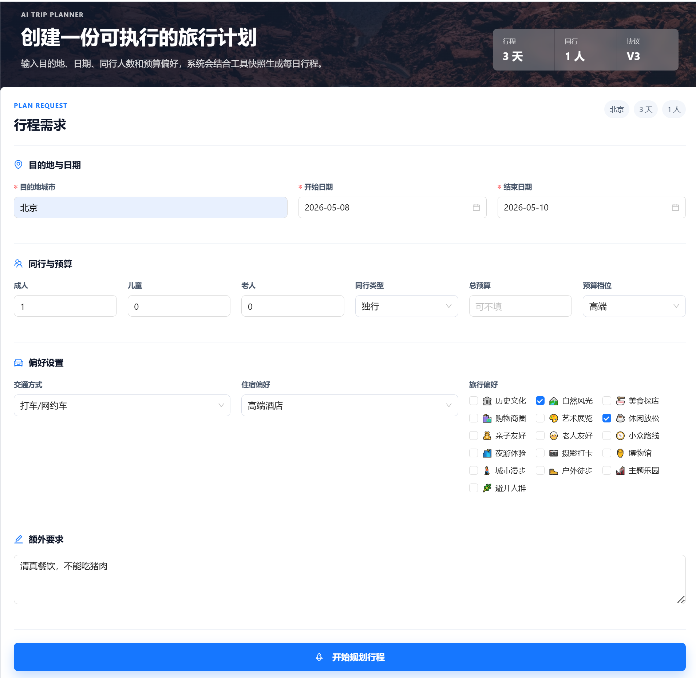

# HelloAgents Trip Planner

An intelligent travel assistant for real-world trip-planning scenarios. The repo ships a runnable web app, a FastAPI backend, structured tool snapshots backed by Amap (Gaode Maps), and keeps the post-training data and evaluation conventions.

The public repo focuses on the stable Planner mainline: the backend compiles the user request, party size, budget, accommodation, weather, attractions, hotels, food, and price hints into an auditable `PlannerContext`, and the Planner model then generates a structured `TripPlan JSON` within those constraints. Historical experiment pipelines, private discussion logs, model weights, training checkpoints, run logs, and local secrets are not uploaded.

## Features

- Generate multi-day trip plans: destination, dates, party size, budget, transportation, accommodation, and preferences jointly constrain the output.
- Structured tool snapshots: the backend collects attractions, hotels, food, weather, price hints, and candidate counts to reduce model fabrication.
- Budget-ledger training convention: explicitly separates hotel per-room nightly price, adult attraction ticket price, per-person per-meal price, and party size.
- Web UI: Vue 3 + TypeScript + Ant Design Vue, supporting trip-request input and result display.
- Post-training assets: SFT data, frozen evaluation sets, rule-based eval metrics, baseline summaries, and data-generation scripts.

## UI Preview

Trip request form:



Trip plan result:


## Tech Stack

Backend:

- FastAPI
- HelloAgents `SimpleAgent`
- Amap (Gaode) HTTP API / amap MCP helper interfaces
- OpenAI-compatible LLM service
- Pydantic schema validation

Frontend:

- Vue 3
- TypeScript
- Vite
- Ant Design Vue
- Amap (Gaode) Web JS API

Training & evaluation:

- LLaMA-Factory data format
- `PlannerContext` protocol
- Rule-based evaluation scripts
- SFT / DPO data-preparation scripts

## Directory Structure

See [PROJECT_STRUCTURE.md](PROJECT_STRUCTURE.md) for full directory responsibilities and the local/public asset boundary.

```text
helloagents-trip-planner/
├── backend/
│   ├── app/
│   │   ├── agents/          # Planner Agent, prompts, and generation-failure feedback
│   │   ├── api/             # FastAPI routes
│   │   ├── models/          # TripRequest / TripPlan schemas
│   │   ├── planner/         # PlannerContext, budget, ticket prices, routes, output validation
│   │   ├── rag/             # Optional RAG retrieval (Qdrant hybrid search)
│   │   └── services/        # LLM, Amap, image, and other service wrappers
│   ├── requirements.txt
│   └── run.py
├── docs/
│   └── images/              # README screenshots
├── frontend/
│   ├── src/
│   │   ├── services/
│   │   ├── types/
│   │   └── views/
│   ├── package.json
│   └── vite.config.ts
├── skills/               # Codex local-workflow skills
├── training/
│   ├── configs/             # Training configs grouped by model
│   ├── data/                # Training / evaluation data
│   ├── docs/                # Protocol, metrics, and post-training notes
│   ├── outputs/eval/        # Public evaluation summaries
│   ├── prompts/             # Data-generation prompts
│   └── scripts/             # Training scripts, grouped by shared/serving/validation and current task
├── PROJECT_STRUCTURE.md  # Project-level directory index
└── README.md
```

## Quick Start

### Prerequisites

- Python 3.11
- Node.js 22 or compatible
- Amap (Gaode) API Key
- OpenAI-compatible LLM API Key
- Optional: Unsplash API Key for attraction images

### Backend

```bash
cd helloagents-trip-planner/backend
python -m venv .venv
source .venv/bin/activate
pip install -r requirements.txt
cp .env.example .env
```

Edit `backend/.env` and set at least:

```bash
AMAP_API_KEY=your_amap_api_key
LLM_MODEL_ID=your_model_name
LLM_API_KEY=your_llm_api_key
LLM_BASE_URL=your_openai_compatible_base_url
```

Start the service:

```bash
python run.py
```

Default addresses:

- API: `http://localhost:7000`
- Swagger: `http://localhost:7000/docs`
- Health check: `http://localhost:7000/health`

### Frontend

```bash
cd helloagents-trip-planner/frontend
npm ci
cp .env.example .env
```

Edit `frontend/.env`:

```bash
VITE_API_BASE_URL=http://localhost:7000
VITE_AMAP_WEB_KEY=your_amap_web_key
VITE_AMAP_WEB_JS_KEY=your_amap_web_js_key
```

Start the dev server:

```bash
npm run dev -- --host 0.0.0.0 --port 5173
```

Default address:

- Web: `http://localhost:5173`

## API Overview

After starting the backend, visit `http://localhost:7000/docs` for the full OpenAPI documentation. Main endpoints:

- `POST /api/trip/plan`: generate a trip plan
- `GET /api/trip/health`: check the Planner service
- `GET /api/map/poi`: search POIs
- `GET /api/map/weather`: query weather
- `POST /api/map/route`: plan a route
- `GET /api/poi/detail/{poi_id}`: get POI details
- `GET /api/poi/photo`: get attraction images
- `POST /api/rag/search`: retrieve travel posts (RAG, optional module)

## Optional Modules: RAG Retrieval & Critic Reflection Loop

Two optional modules were added on top of the core planner. Both are off unless
their environment variables are set, so the default planner flow is unchanged.

### RAG retrieval (`backend/app/rag/`)

Hybrid retrieval over crawled travel posts. It combines a **dense** vector
(Qwen3-Embedding-8B via ModelScope, 4096-d) with a **sparse** vector (jieba
term-frequency whose IDF is computed server-side by Qdrant's `Modifier.IDF`),
fuses them with Qdrant's RRF Query API, filters by a normalized **credibility**
score (server-side), and applies a light rerank (similarity + credibility +
freshness). Import posts, then search:

```bash
cd backend
python scripts/rag_import.py --data ../out/rag/xhs_beijing.json
python scripts/rag_search.py --query "北京免费逛的公园" --top-k 5
```

Required env (`backend/.env`): `MODELSCOPE_API_KEY`, `QDRANT_URL`,
`QDRANT_API_KEY`, `RAG_COLLECTION`, `RAG_CREDIBILITY_THRESHOLD`. API:
`POST /api/rag/search` with `{query, top_k, city}`.

### Critic reflection loop (`backend/app/agents/critic.py`)

An optional `generate -> critic -> revise` loop. The Critic is two-layer: a
**deterministic** layer reuses the existing rerank metrics (budget overspend,
hallucinated POIs, meal/attraction dedup) and produces structured, located
violations; a **gated LLM** layer (only runs when the deterministic layer is
clean) judges what rules cannot — geographic detours, pacing, persona fit (e.g.
elders/children), and free-text requirements. The planner revises against the
critique until it passes, hits `PLANNER_MAX_REVISE`, or stops on oscillation.
Enable in `backend/.env`:

```bash
PLANNER_ENABLE_CRITIC=1
PLANNER_MAX_REVISE=2
```

## Troubleshooting

### Planner returns empty plans / falls back every time (reasoning vs. chat models)

**Symptom:** Every generation attempt fails and the API returns a generic
fallback plan. `training/data/online_feedback/planner_failures.jsonl` shows
repeated rows with an empty `rejected` field and the error
`响应中未找到完整的顶层TripPlan JSON对象` ("no top-level TripPlan JSON object
found").

**Root cause:** `LLM_MODEL_ID` was set to a **reasoning model** (e.g.
`deepseek-v4-flash`). Reasoning models emit their chain-of-thought in a separate
`reasoning_content` field and only afterwards produce the answer in `content`.
For the large, rule-heavy planner prompt the reasoning alone consumes the entire
`max_tokens` budget (`finish_reason: length`, `reasoning_tokens == max_tokens`),
so `content` comes back empty. The pipeline reads only `content` and expects a
direct JSON object, so parsing always fails.

Evidence (identical prompt, `max_tokens=2000`):

| Model | finish_reason | content | reasoning_content |
|-------|---------------|---------|-------------------|
| `deepseek-v4-flash` (reasoning) | `length` | empty | 3271 chars |
| `deepseek-chat` (non-reasoning) | `stop` | 9413 chars of JSON | empty |

**Fix:** use a **non-reasoning chat model** that outputs JSON directly:

```bash
# backend/.env
LLM_MODEL_ID=deepseek-chat
```

The planner pipeline (prompt design + `content`-only JSON extraction) is built
for direct-output chat models, not reasoning models. Using a reasoning model
would require a much larger `max_tokens` plus logic to read `reasoning_content`,
which is slower and not supported here.

**Guardrail:** the LangGraph planner now detects empty content and fails fast
with `EmptyLLMResponseError` (logged with `preference_reason=planner_empty_response`)
instead of the opaque "no JSON found" error, so this misconfiguration is obvious
in the logs.

### Planner LLM returns 401 / wrong provider after enabling RAG

**Symptom:** the planner falls back to a template on every request; logs show
`提供商: modelscope` and `401 ... api key ...0b34 is invalid` (that key is the
ModelScope key, not your LLM key).

**Root cause:** `HelloAgentsLLM()` auto-detects its provider from the
environment and prefers `modelscope` once `MODELSCOPE_API_KEY` (added for RAG) is
present, hijacking the planner LLM away from your `LLM_BASE_URL` (e.g. deepseek).

**Fix:** pin the OpenAI-compatible provider explicitly in `backend/.env`:

```bash
LLM_PROVIDER=openai
OPENAI_API_KEY=<your-llm-key>
OPENAI_BASE_URL=https://api.deepseek.com
OPENAI_MODEL=deepseek-chat
```

## Post-training Assets

The `training/` directory records the training and evaluation mainline. The approach is to first have the backend produce a stable, auditable `PlannerContext`, then teach the model to convert it into valid `TripPlan JSON`.

Recommended entry points:

- [training/docs/教程/旅行助手后训练实战教程.md](training/docs/教程/旅行助手后训练实战教程.md): hands-on tutorial from PlannerContext to SFT, Best-of-N, and evaluation
- [training/README.md](training/README.md): post-training directory overview
- [training/STRUCTURE.md](training/STRUCTURE.md): directory boundaries for training assets, data, scripts, and reports
- [training/docs/README.md](training/docs/README.md): long-form documentation index
- [training/outputs/eval/README.md](training/outputs/eval/README.md): evaluation outputs and public report index
- [training/outputs/eval/reports/260512_bestofn_replay_extended_w10/README.md](training/outputs/eval/reports/260512_bestofn_replay_extended_w10/README.md): current evaluation report bundle (2026-05-12)

The current repo keeps the mainline material; historical data, private discussion logs, model weights, checkpoints, and large run artifacts are not uploaded.

## Security & Ignore Rules

Do not commit real secrets. `.gitignore` already excludes:

- `backend/.env`, `frontend/.env`
- Python / Node local environments
- `node_modules/`, build artifacts, logs
- Training outputs, model weights, checkpoints
- Historical pipelines and deprecated prompt ablations
- Private author discussions, session memory, and scratch docs

`.env.example` is kept in the repo as a configuration template.

## License

CC BY-NC-SA 4.0

## Acknowledgements

- [HelloAgents](https://github.com/datawhalechina/Hello-Agents)
- [Amap (Gaode) Open Platform](https://lbs.amap.com/)
